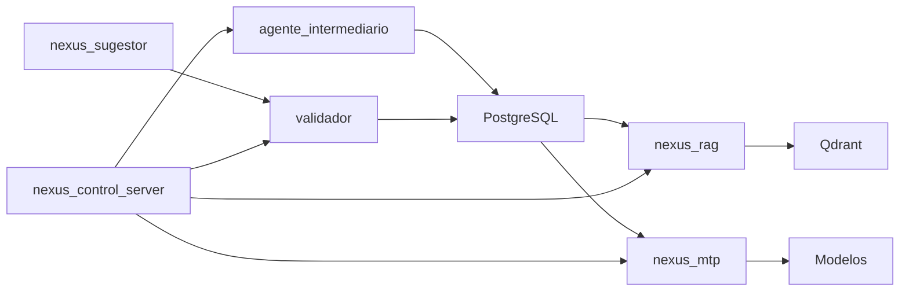

# Projeto N.E.X.U.S

[](https://github.com/projetonexusdepain85352-coder/Projeto-NEXUS/actions/workflows/ci.yml)
[](https://codecov.io/gh/projetonexusdepain85352-coder/Projeto-NEXUS)
[](LICENSE)

## Visao Geral
NEXUS e um sistema de IA privada com coleta, validacao humana, indexacao RAG e pipeline de treino especializado.

## Arquitetura (alto nivel)


## Estrutura do Repositorio
- `src/`: codigo-fonte dos modulos.
- `config/`: scripts operacionais e configs auxiliares.
- `database/`: migracoes e schema de referencia.
- `docs/`: documentacao de arquitetura e runbooks.
- `tests/`: testes unitarios e de integracao.

## Quick Start (minimo)
1. Defina variaveis de ambiente essenciais:
```bash
export KB_READER_PASSWORD=... 
export KB_INGEST_PASSWORD=...
export POSTGRES_HOST=localhost
export POSTGRES_PORT=5433
export POSTGRES_DB=knowledge_base
export QDRANT_URL=http://localhost:6333
```
Observacao: nao existem senhas padrao; defina KB_READER_PASSWORD e KB_INGEST_PASSWORD (ou NEXUS_KB_INGEST_PASSWORD para scripts auxiliares).
2. Compile o workspace:
```bash
cargo build --workspace
```
3. Fluxo basico:
```bash
cargo run -p agente_intermediario
cargo run -p nexus_validador
cargo run -p nexus_rag -- status
cargo run -p nexus_mtp -- status
python3 src/nexus_control_server/server.py
```

## Documentacao de API
- `docs/api/nexus_control_server.md`
- `docs/api/nexus_rag.md`
- `docs/api/nexus_mtp.md`

## Contribuicao
Ao contribuir, voce concorda em licenciar suas contribuicoes sob a Apache-2.0.

## Referencias
- Politica de grounding: `docs/architecture/NEXUS_GROUNDING_POLICY.md`
- Runbook legado do painel: `docs/runbooks/nexus_control_server_README.md`
