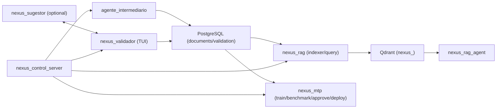

# Arquitetura

## Pipeline completo (texto)



## Validador e Sugestor

- `nexus_validador` e uma TUI em Rust.
- `nexus_sugestor` e um servico Python opcional, acessado via socket UNIX.
- Socket padrao: `/tmp/nexus_sugestor.sock` (configuravel em `NEXUS_SUGESTOR_SOCKET`).
- O sugestor consulta o Ollama local e responde JSON com `util`, `confianca`, `motivo`.

Exemplo de payload (uma linha JSON):
```
{"domain":"seguranca","content":"texto do documento"}
```
Resposta esperada:
```
{"util":true,"confianca":85,"motivo":"texto curto"}
```

## Controle de servicos

- `nexus_control_server` e um backend HTTP em Python para iniciar/parar servicos.
- Usa `services.json` para descrever comandos, cwd e variaveis de ambiente.
- Pode expor a UI via Cloudflare Tunnel/Worker (opcional).

## Fluxo do nexus_rag_agent

```
query
  -> Qdrant (STRICT_MIN_SCORE = 0.35, top_k = 5)
  -> prompt com [CHUNK_X]
  -> Ollama (Mistral)
  -> verificador holistico (best_score >= VERIFIER_THRESHOLD)
  -> resposta grounded ou GROUNDING_DENIED
```

### denied_reason

- `no_chunks`: Qdrant nao retornou evidencias acima do threshold.
- `verifier_failed`: best_score do verificador abaixo do threshold.
- `insufficient_context`: modelo declarou falta de informacao.

## Politica de grounding

- Nenhum componente pode responder com fallback parametrico.
- Sem evidencia suficiente: negar a resposta explicitamente.
- Evidencia abaixo do threshold ou metadados incompletos (ex.: sem `document_id`) deve negar.

## Verificador holistico

- Embeda a resposta inteira e compara com cada chunk recuperado.
- `best_score` = maior similaridade cosine com qualquer chunk.
- `supported = best_score >= VERIFIER_THRESHOLD`.
- `VERIFIER_THRESHOLD` default 0.55 (recomendado 0.45 em `.env`).

## Citation Engine

- Contexto enviado ao modelo contem chunks numerados: `[CHUNK_1] ...`.
- O prompt exige citacao `[CHUNK_X]` por sentenca.
- O verificador remove tags `[CHUNK_X]` antes de embedar.

## Qdrant

- Collections por dominio: `nexus_security`, `nexus_rust`, `nexus_infra`, `nexus_mlops`.
- URL obrigatoria via `QDRANT_URL` (gRPC 6336).

## Embedding e chunking

- Modelo: `all-MiniLM-L6-v2`
- Dimensao: 384
- Chunking: 400 palavras com overlap 50 (em `nexus_rag/src/indexer.rs`)
