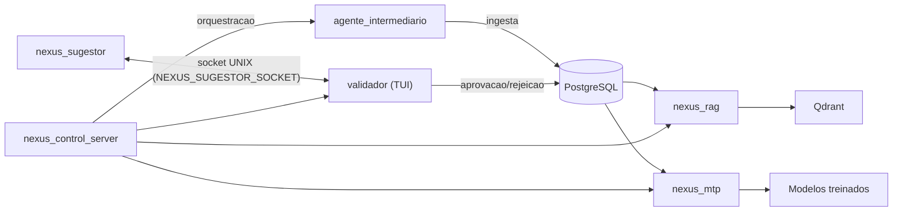

# Visao Geral da Arquitetura

O NEXUS e um sistema de IA privada com pipeline completo de coleta, validacao humana, indexacao RAG e treino especializado.

## Fluxo principal


## Interface validador <-> nexus_sugestor
- Transporte: socket UNIX.
- Caminho padrao do socket: `/tmp/nexus_sugestor.sock`.
- O validador usa a variavel `NEXUS_SUGESTOR_SOCKET` para descobrir o socket.
- Payload enviado (uma linha JSON):
```json
{"domain":"seguranca","content":"texto do documento"}
```
- Resposta esperada (uma linha JSON):
```json
{"util":true,"confianca":85,"motivo":"texto curto"}
```
- Observacao: o servidor roda em Python e consulta o Ollama local.

## Interfaces externas
- `nexus_control_server`: painel HTTP em Python para orquestracao.
- `nexus_rag`: CLI para indexacao e consulta.
- `nexus_mtp`: CLI para extracao, benchmark e deploy.

## Observabilidade
- Logging padronizado com `tracing`.
- Endpoints `/metrics` e `/health` no `nexus_control_server`.